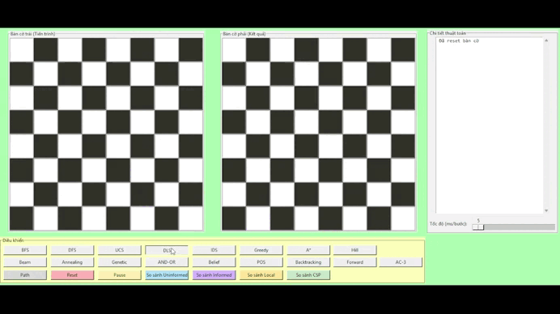
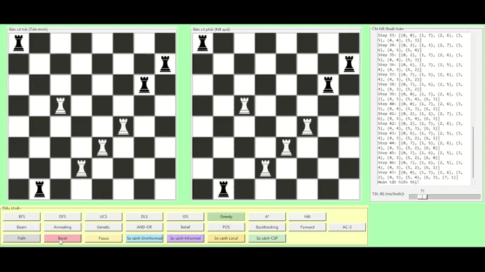
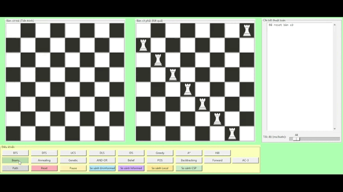
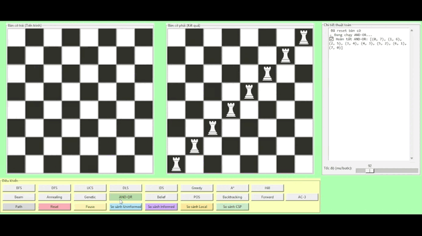
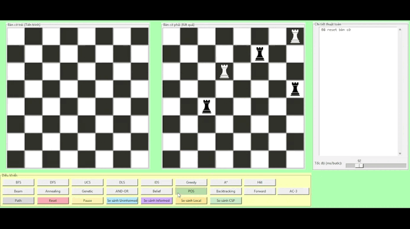

<div align="center">
    
    <h1>8 Rooks - 17 Search Algorithms</h1>
    <p>Mô phỏng bài toán 8 quân Xe bằng 17 thuật toán tìm kiếm </p>
</div>

---

| STT | Họ và tên            | MSSV       |
|-----|----------------------|------------|
| 1   | Nguyễn Thái Bình     | 23110080   |

---

# BÁO CÁO CÁ NHÂN 8 ROOKS - 17 SEARCH ALGORITHMS

## 1. Mục tiêu
Bài báo cáo xây dựng một hệ thống mô phỏng bài toán 8 quân Xe với 17 thuật toán tìm kiếm sử dụng ngôn ngữ Python.  
Chương trình hỗ trợ:
- **Chạy các thuật toán trên bàn cờ phải của giao diện bằng cách nhấn các nút thuật toán bên dưới màn hình.
- **Hiển thị tiến trình đường đi từng bước trên bàn cờ trái của giao diện. (Path)**.
- **So sánh hiệu năng** giữa các nhóm thuật toán bằng biểu đồ `matplotlib`.
- **Giao diện trực quan thân thiện** giúp người học hiểu rõ cách hoạt động của từng thuật toán.

---

## 2. Nội dung

### 2.1. Nhóm thuật toán tìm kiếm không có thông tin (Uninformed Search)
#### a) Breadth-First Search (BFS)
- **Mô tả:** Bắt đầu từ bàn cờ trống, lần lượt đặt Xe theo hàng ngang, mở rộng các trạng thái con bằng cách thêm Xe vào cột hợp lệ. BFS dùng hàng đợi (`queue`) mở rộng theo chiều rộng, đảm bảo tìm ra lời giải đầu tiên có độ sâu nhỏ nhất. Bắt đầu từ trạng thái rỗng [], mỗi bước đặt thêm một Xe mới.
Thuật toán mở rộng lần lượt theo chiều rộng của cây trạng thái, nghĩa là xem xét tất cả các cách đặt Xe cho hàng hiện tại trước khi sang hàng tiếp theo.
Khi đạt trạng thái có 8 Xe (len(s) == 8), trả về nghiệm đầu tiên.
- **Ý tưởng chính:**
BFS đảm bảo tìm được nghiệm đầu tiên có độ sâu nhỏ nhất, minh họa tư duy tìm kiếm theo tầng. Tuy nhiên, do lưu nhiều trạng thái, BFS tiêu tốn nhiều bộ nhớ khi không gian tìm kiếm lớn.
- **Minh họa:**


#### b) Depth-First Search (DFS)
- **Mô tả:** Duyệt theo chiều sâu, thử đặt Xe theo từng hàng. Khi không còn nước đi hợp lệ thì quay lui (`backtrack`) về trạng thái trước đó. DFS tiết kiệm bộ nhớ nhưng có thể đi sai nhánh. 


#### c) Uniform Cost Search (UCS)
- **Mô tả:** Tương tự BFS nhưng ưu tiên trạng thái có chi phí `g(n)` nhỏ nhất. Trong bài toán 8 Rooks, chi phí thường là số lượng quân Xe đã đặt.
- **Minh họa:**


#### d) Iterative Deepening Search (IDS)
- **Mô tả:** Kết hợp ưu điểm của DFS (tiết kiệm bộ nhớ) và BFS (tìm nghiệm tối ưu). Thuật toán lặp tăng dần giới hạn độ sâu cho đến khi tìm được cấu hình hợp lệ.
- **Minh họa:**


#### c) Depth Limited Search(DLS)
- **Mô tả:** Giống A* nhưng thực hiện theo giới hạn `f(n)` tăng dần, giảm tiêu tốn bộ nhớ.
- **Minh họa:**  


---

### 2.2. Nhóm thuật toán tìm kiếm có thông tin (Informed Search)
#### a) Greedy Best-First Search
- **Mô tả:** Chọn trạng thái có `h(n)` (số cặp Xe tấn công nhau) nhỏ nhất để mở rộng — thuật toán “tham lam” hướng đến lời giải nhanh nhất nhưng không đảm bảo tối ưu.
- **Minh họa:**  


#### b) A* Search
- **Mô tả:** Dựa trên công thức `f(n) = g(n) + h(n)`, mở rộng node có giá trị `f(n)` nhỏ nhất. Trong 8 Rooks, `h(n)` là số xung đột giữa các Xe.
- **Minh họa:**  


---

### 2.3. Nhóm thuật toán tìm kiếm cục bộ (Local Search)
#### a) Hill-Climbing
- **Mô tả:** Tạo lời giải ngẫu nhiên và di chuyển sang trạng thái láng giềng có ít xung đột hơn cho đến khi đạt cực trị 
- **Minh họa:**

#### b) Beam Search
- **Mô tả:** Giữ lại k trạng thái tốt nhất mỗi vòng lặp, giúp tránh sa vào cực trị cục bộ. 
- **Minh họa:**

#### c) Simulated Annealing
- **Mô tả:** Cho phép chấp nhận bước “xấu hơn” với xác suất giảm dần, giúp thoát cực trị cục bộ. 
- **Minh họa:**

#### d) Genetic Algorithm
- **Mô tả:** Mỗi lời giải là một cá thể; lai ghép, đột biến để tiến hóa đến cấu hình không xung đột. 
- **Minh họa:**


---

### 2.4. Nhóm thuật toán trong môi trường phức tạp (Complex Search)
#### a) AND-OR Search
- **Mô tả:** Mô hình hóa lời giải theo dạng cây điều kiện; mỗi bước đặt Xe cần thỏa mãn điều kiện AND (không trùng cột) và lựa chọn OR (vị trí đặt tiếp theo).
- **Minh họa:**

#### b) Belief-State Search
- **Mô tả:** Xử lý trường hợp không chắc chắn: thay vì một trạng thái, thuật toán lưu tập hợp các trạng thái có thể.
- **Minh họa:**  

#### c) Partially Observable Search (POS)
- **Mô tả:** Môi trường chỉ quan sát được một phần — thuật toán giả định vị trí có nhiễu 20% và mở rộng các khả năng có thể.
- **Minh họa:**  


---

### 2.5. Nhóm thuật toán CSP (Constraint Satisfaction Problems)

#### a) Backtracking
- **Mô tả:** Duyệt thử-sai có quay lui; kiểm tra ràng buộc từng hàng.
- **Minh họa:**  

#### b) Forward Checking
- **Mô tả:** Khi đặt Xe mới, loại bỏ trước các giá trị cột không hợp lệ ở các hàng còn lại.
- **Minh họa:**  

#### c) AC-3 (Arc Consistency)
- **Mô tả:** Duy trì tính nhất quán cung: loại bỏ giá trị không phù hợp giữa các biến (hàng, cột).
- **Minh họa:**  


---

## 3. So sánh hiệu năng các nhóm thuật toán

| Nhóm | Thuật toán | Thời gian trung bình (s) | Node mở rộng | Nhận xét |
|------|-------------|---------------------------|---------------|-----------|
| **Uninformed** | BFS, DFS, UCS, IDS | 0.2 – 1.4 | 8 – 15 | BFS ổn định, IDS tối ưu hơn DFS |
| **Informed** | Greedy, A*, IDA* | 0.17 – 5.5 | 3 – 5 | A* cân bằng giữa tốc độ và tối ưu |
| **Local** | Hill, Beam, Annealing, Genetic | 0.6 – 2.0 | 15 – 25 | Genetic hội tụ tốt nhất |
| **CSP** | Backtracking, Forward-Check, AC-3 | 0.7 – 1.1 | 8 – 12 | AC-3 hiệu quả nhất về pruning |
| **Complex Env.** | AND-OR, Belief, POS | 1.0 – 2.8 | 10 – 20 | POS diễn giải rõ môi trường nhiễu |

---

## 4. Cài đặt & Chạy chương trình
### Yêu cầu
```bash
pip install pillow
pip install matplotlib
```
---

## 5. Tài liệu tham khảo
- Russell, S. J., & Norvig, P. (2016). *Artificial intelligence: A modern approach* (3rd ed.). Pearson Education Limited.  
- Russell, S. J., & Norvig, P. (2020). *Artificial intelligence: A modern approach* (4th ed.). Pearson Education Limited.  
